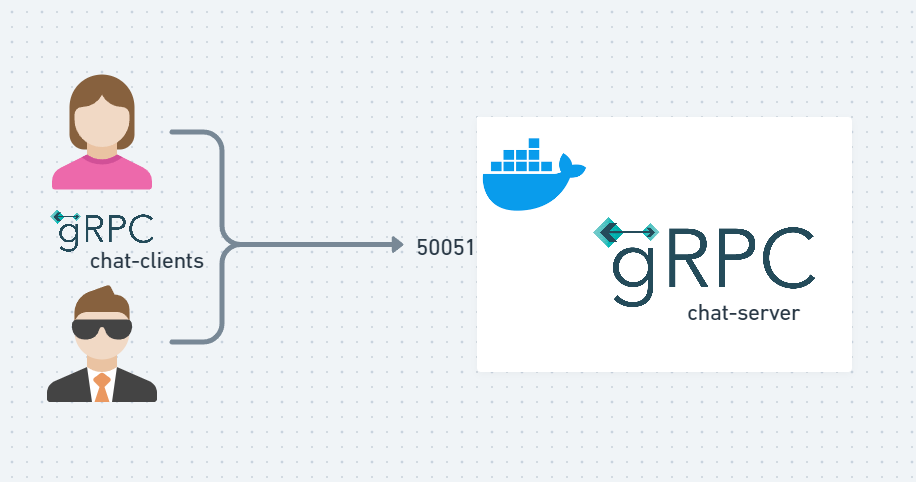
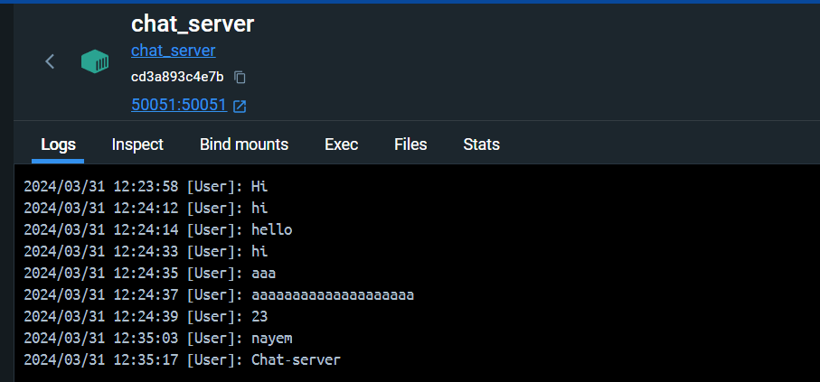
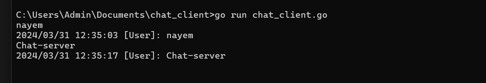

# Chat Application with gRPC

This project implements a simple chat application using gRPC. It provides a isolated chat server deployed using docker microservice that listens for incoming messages and broadcasts them to all connected clients.



## Features

- **gRPC Communication**: Uses gRPC for communication between the server and clients.
- **Broadcast Messaging**: Broadcasts messages from clients to all connected clients.
- **Docker Support**: Includes Docker configuration for easy deployment.

## Usage

### Building the Docker Image

To build the Docker image for the chat server, run the following command in the project directory:

```bash

docker build -t chat_server .
docker run -d -p 50051:50051 --name chat_server_container chat_server

```
### Server

### Client



